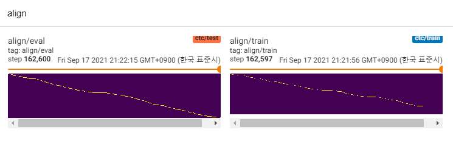
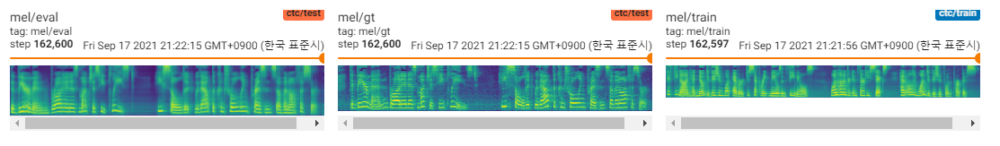

# tf-mlptts

Tensorflow implementation of MLP-Mixer based TTS.

- It is for testing mlp-based architecture and TTS compatibility.
- Experimental detail is described on [Philosophy](#philosophy).

## Requirements

Tested in python 3.7.9 ubuntu conda environment, [requirements.txt](./requirements.txt)

## Usage

To download LJ-Speech dataset, run under script.

Dataset will be downloaded in '~/tensorflow_datasets' in tfrecord format. If you want to change the download directory, specify `data_dir` parameter of `LJSpeech` initializer.

```python
from speechset.datasets import LJSpeech

# lj = LJSpeech(data_dir=path, download=True)
lj = LJSpeech(download=True) 
```

To train model, run [train.py](./train.py). 

Checkpoint will be written on `TrainConfig.ckpt`, tensorboard summary on `TrainConfig.log`.

```bash
python train.py
tensorboard --logdir .\log
```

If you want to train model from raw audio, specify audio directory and turn on the flag `--from-raw`.

```bash
python .\train.py --data-dir ./LJSpeech-1.1/wavs --from-raw
```

To start to train from previous checkpoint, `--load-epoch` is available.

```bash
python .\train.py --load-epoch 20 --config D:\tf\ckpt\mlptts.json
```

Pretrained checkpoints are relased on [releases](https://github.com/revsic/tf-mlptts/releases).

To use pretrained model, download files and unzip it. Followings are sample script.

```py
from config import Config
from mlptts import MLPTextToSpeech

with open('mlptts.json') as f:
    config = Config.load(json.load(f))

tts = MLPTextToSpeech(config.model)
dummies = {
    'text': tf.zeros([1, 1], dtype=tf.int32),
    'textlen': tf.ones([1], dtype=tf.int32),
    'mel': tf.zeros([1, 5, config.model.mel]),
    'mellen': tf.convert_to_tensor([5], dtype=tf.int32),
}
# build
tts(**dummies)
# restore
tts.restore('./mlptts_299.ckpt-1').expect_partial()
```

Inferenece code sample is available on [inference.py](./inference.py)

## Learning Curve

train LJSpeech 300 epochs with [tf-diffwave](https://github.com/revsic/tf-diffwave)






## Philosophy

So far, there is a lot of TTS researches, especially parallel feed-forward models are trends these days. MLP-TTS is one of them with CTC-based duration distillation, introduced by AlignTTS[6].

On the other side, MLP-Mixer[1] and ResMLP[2] introduce MLP-only architectures for NN backbones.

Since transformer and convolutions are major backbones on current TTS fields, I try to research the other backbones which can be compatible with TTS. And MLP-TTS is experiments for TTS with MLP-based architectures.

### 1. Dynamic length MLP (~ 2021.06.)

The first issue was how to model MLP for dynamic length inputs.

MLP-Mixer[1] and ResMLP[2] assume a fixed number of patches and it is possible to use MLP on the temporal axis. But in the TTS case, as it accepts dynamic size inputs, MLP with fixed size weights is incompatible with these tasks.

I propose some dynamic-length MLP-like architectures, which can be found on [mlp.py](./mlptts/mlpmixer/mlp.py).

A. ConvMLP

`ConvMLP` uses wide length MLP on temporal axis. To deal with temporal dynamicity, it makes fixed length frames with overlapped regions, which can be simply found on STFT (Short-term Fourier Transform). After two MLP layers, it operates overlap-and-add to make the single sequence. 

For computational efficiency, 2D convolution and transposed convolution are chosen, but it is not practical since large size of memory is required (batch x num_frames x frame_size). And since we choose transposed convolution for cuda-accelaration of overlap-and-add, window function cannot be adaptable in operation sequence (ex. hann window).

B. TemporalConv

It is simple convolution only acts on temporal axis. To prevent the operation on channel axis, Conv2D with [S, 1] stride and [K, 1] kernel is used on expanded input features [B, T, C, 1].

C. DynTemporalMLP

It computes dynamic MLP weights from input features. For simplicity, mlp operates on transposed and concatenated features.
> [B, 1, T, C] x [B, T, 1, C] = [B, T, T, Cx2] -> [B, T, T, 1]

It has two philosophical differences between MLP-Mixer.

First, Mixer separates the module into two exclusive operations, channel-level MLP and temporal-level MLP. But `DynTemporalMLP` acts on the channel axis for computing dynamic weights. 

Second, since MLP learns the weights from individual positions, additional positional information is unnecessary. But `DynTemporalMLP` requires positional embeddings since it just computes the weights from two features of different positions, permutation invariant.

---
In baseline, mlp-tts uses large size `TemporalConv` for temporal transformation.

### 1.1. Dynamic length MLP (2021.07 ~)

After I release [Beta-v0.1](https://github.com/revsic/tf-mlptts/releases/tag/beta-v0.1), some researches about dynamic-length MLP are introduced. It can be the one choice to encode dynamic-length features with MLP.

- CycleMLP: A MLP-like Architecture for Dense Prediction [[arXiv](https://arxiv.org/abs/2107.10224)]

### 2. MLP-Mixer vs ResMLP

In experiments, there are too many dense operations and training procedure was instable. I met many NaNs on train.

I check some possibilities to stabilize training procedure.

A. Layer normalization, MLP-Mixer

Like Transformer (Vaswani et al., 2017), MLP-Mixer[1] uses layer normalization on each residual blocks. In mlptts, it cannot stabilize the training.

B. Affine-transform, ResMLP

In paper of CaiT (Touvron et al., 2021), it introduces LayerScale, which use affine transform with small value of scale factor. ResMLP[2] uses LayerScale and mlptts can be stabilized with this method.

C. DDI-ActNorm, RescaleNet

RescaleNet[5] introduces DDI(data-dependent initialization) based debiasing for the solution of dead ReLU. Inspired by RescaleNet, I try to alter the affine transform with DDI-based activation normalization (Glow, Kingma et al., 2018). But effect was minimal and the key was the small value of scaling factor.

---
In baseline, mlp-tts uses affine transform with the small value of scaling factor.

### 3. Gaussian upsampling vs Regulator (~ 2021.06.)

From FastSpeech (Ren et al., 2019), explicit duration modeler is common on TTS in nowadays. MLP-TTS also tries an explicit duration modeler and end-to-end with a gaussian upsampler.

Regulator from Parallel Tacotron 2[4] is a more recent contribution, but it is unstable on mlp-tts. My guess of the reason why regulator was possible on parallel tacotron 2 was it assumes the locality with light-weight dynamic convolution, so that monotonicity of alignment can be inferenced from encoded features. However, MLP-TTS uses MLP and large-size temporal convolution, so that locality assumption can be freed and monotonicity cannot be inferenced from features.

So I explicitly assume the monotonicity with the gaussian upsampling mechanism (Parallel Tacotron[3]), and it can stabilize the mlp-tts training.

### 3.1. CTC and MAS based alignment distillation (2021.07. ~)

After I release [Beta-v0.1](https://github.com/revsic/tf-mlptts/releases/tag/beta-v0.1), I think the end-to-end train is still unstable and distillation could be the solution to the alignment problem.

There are many distillation modules, such as the autoregressive decoder (ex. JDI-T[7]), Flow-based decoder and monotonic alignment search (=MAS, ex. Glow-TTS[8]), and refining from positional encodings (ex. ParaNet[9]).

Except for those of them, I'm interested in AlignTTS[6]. It uses the Mixture-density network and CTC-like objective for modeling the relationship between mel-spectrogram and text, then it finds alignment with Viterbi-algorithm.

MLP-TTS also uses MDN and CTC for modeling mutual information between text and mel-spectrogram, and find the alignment with monotonic-alignment search from likelihood matrix instead of Viterbi algorithm. Then it is reduced to durations and distilled to durator modules.

CTC+MAS is better than gaussian upsampler, concerning spectrogram restoration. It can generate human audible speeches and samples could be found on [WIP]. I estimate the reason for the failure is that the gradient of the durator did not backward to the text encoders, and text encoders could generate only context features.

### 4. Future works

Since it is just POC models, samples are noisy and pronunciation is unclear. There are many factors that can be tuned and improved, such as dynamic length MLP modules or kernel length parameters, etc. It will be hard for me to make further improvements (it was just term project), but I would appreciate it if someone posts PR. Thanks for your attention.

### Reference
[1] MLP-Mixer: An all-MLP Architecture for Vision, Tolstikhin et al., 2021. \
[2] ResMLP: Feedforward networks for image classification with data-efficient training, Touvron et al., 2021. \
[3] Parallel Tacotron: Non-Autoregressive and Controllable TTS, Elias et al., 2020. \
[4] Parallel Tacotron 2: A Non-Autoregressive Neural TTS Model with Differentiable Duration Modeling, Elias et al., 2021. \
[5] Is normalization indispensable for training deep neural networks, Shao et al., 2020. \
[6] AlignTTS: Efficient Feed-Forward Text-to-Speech System without Explicit Alignment
, Zheng et al., 2020. \
[7] JDI-T: Jointly trained Duration Informed Transformer for Text-To-Speech without Explicit Alignment, Lim et al., 2020.
[8] Glow-TTS: A Generative Flow for Text-to-Speech via Monotonic Alignment Search, Kim et al., 2020.
[9] Non-Autoregressive Neural Text-to-Speech, Peng et al., 2019.

